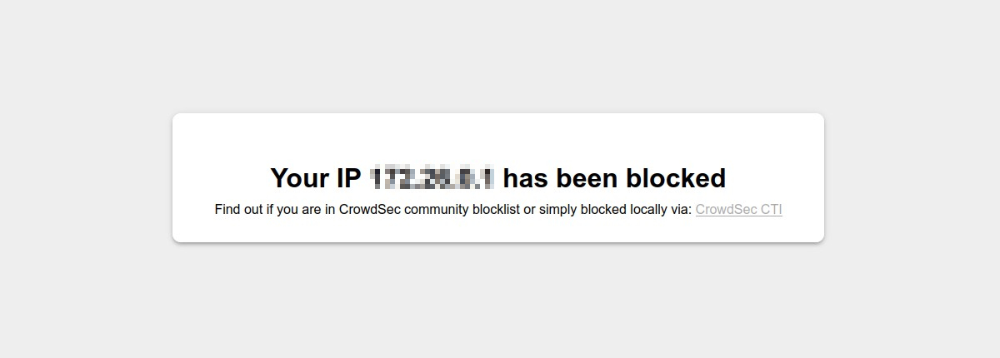

# CrowdSec Engine extension for Magento 2

## User Guide

<!-- START doctoc generated TOC please keep comment here to allow auto update -->
<!-- DON'T EDIT THIS SECTION, INSTEAD RE-RUN doctoc TO UPDATE -->
**Table of Contents**

- [Description](#description)
- [Usage](#usage)
  - [Features](#features)
    - [Detect suspicious behavior](#detect-suspicious-behavior)
    - [Push signals to the CrowdSec community](#push-signals-to-the-crowdsec-community)
    - [Retrieve CrowdSec banned IPs](#retrieve-crowdsec-banned-ips)
    - [Block access to banned IPs](#block-access-to-banned-ips)
    - [Enrollment](#enrollment)
  - [Configurations](#configurations)
    - [General Settings](#general-settings)
    - [Scenarios and signals](#scenarios-and-signals)
      - [Leaking bucket concept](#leaking-bucket-concept)
      - [Black hole concept](#black-hole-concept)
    - [Decisions](#decisions)
    - [Crons jobs](#crons-jobs)
    - [Advanced settings](#advanced-settings)
  - [Reports](#reports)

<!-- END doctoc generated TOC please keep comment here to allow auto update -->

## Description

The `CrowdSec Engine` extension for Magento 2 has been designed to protect Magento 2 websites from all kinds of attacks 
by using [CrowdSec](https://www.crowdsec.net/) technology.

## Usage

### Features

#### Detect suspicious behavior

This module can detect "pages scan" and "user admin enumeration" behaviors. For more details, see [this paragraph](#scenarios-and-signals). 

#### Push signals to the CrowdSec community

Beyond a certain threshold, suspicious behavior triggers an alert and a "ban" signal for the detected IP is sent to the community.

#### Retrieve CrowdSec banned IPs

CrowdSec decisions can be pulled from the community blocklist.

#### Block access to banned IPs

If desired, banned IPs can be blocked by a ban wall.

#### Enrollment

Enrolling your security machine gives you access to more details in your [CrowdSec console](https://app.crowdsec.net).

### Configurations

This module comes with configurations that you will find under `Stores → Configurations → Security → CrowdSec Engine` 
admin section.

These configurations are divided in five main parts : `General`, `Scenarios and signals`, `Decisions`, `Crons job` and 
`Advanced`.

#### General Settings

  In the `General` part, you will set your security engine details.

***

 `General → Environment` (`global` scope) 

Environment determines the CrowdSec environment used by the security engine: `Development` for tests, 
and `Production` for real data.

***

`General → Enrollment key` (`global` scope)

If you enroll your security engine, you will have access to a wealth of useful information [in your CrowdSec console](https://app.crowdsec.net/). 

You can obtain your enrollment key in your console.

Once all the necessary fields have been completed, you can click on the "enroll" button.

***

 `General → Security engine name` (`global` scope)

The name that will be display in your console.

***

`General → Force enroll` (`global` scope)

If you already have enrolled your machine, you can force re-enrollment with this option. 

***

#### Scenarios and signals

 In the `Scenarios and signals` part, you can configure the way suspicious IPs are detected and sent to the community as signal.

***

`Scenarios and signals → List of detection scenarios` (`global` scope)

This module comes with two predefined scenarios (`Detect pages scan` and `Detect admin user enumeration`) based on "leaking bucket" and "black hole" concepts.

##### Leaking bucket concept

Each time a suspicious event is detected, we add quantity 1 to a virtual bucket.

At a certain speed, the bucket gradually empties: a quantity of 1 is removed every X seconds. (hence the image of the leak).

An alert will only be triggered if the bucket overflows.

So, for an alert to be triggered, several suspicious events need to be detected in a sufficiently short space of time to cause the bucket to overflow despite the leak.

##### Black hole concept

Once an alert has been detected for a given IP address and scenario, it is likely that the suspect IP address will continue its actions, which will be detected again.

However, to avoid reporting the same alert too often, a certain amount of time must have elapsed since the last detection before the IP's behaviour is analysed again for the same scenario.

During this time, the IP is said to be in the black hole of the scenario.

| Scenario name                 | Description                                                  | Bucket capacity | Bucket leak speed | Black hole duration |
| :---------------------------- | ------------------------------------------------------------ | --------------- | ----------------- | ------------------- |
| Detect pages scan             | Detects IPs that reach 403 or 404 pages.                     | 10              | 10 seconds        | 1 hour              |
| Detect admin user enumeration | Detects IPs attempting to connect to the back office with several incorrect user names. | 10              | 30 seconds        | 1 hour              |

In addition, regardless of the time taken, an alert will be triggered for the "Detect admin user enumeration" scenario if the number of bad user names exceeds 20.

***

`Scenarios and signals → Ban duration` (`global` scope)

When a signal is sent, we use this setting to determine the ban duration (in seconds).

***

####  Decisions

  In the `Decisons` part, you indicate which scenarios you wish to subscribe to in order to retrieve the community's decisions. You can also set whether you want to block banned IPs. Finally, you can set the cache used to store decisions.

***

`Decisions → List of subscribed scenarios` (`global` scope)

Selected scenarios will be used for pulling decisions from community blocklist.

***

`Decisions → Ban IP locally when a scenario triggers an alert` (`global` scope)

If enabled, a "ban" decision will be added to local cache as soon as an alert is triggered for the IP.

***

`Decisions → Bounce banned IP` (`global` scope)

If enabled, a cached "banned" IP will be blocked by a ban wall (403). 

You can edit the content of this ban wall in the "crowdsec-engine-ban-wall" CMS block:

By default, it will have the following design and content: 

***

`Decisions → Cache configuration → Technology` (`global` scope)

Choose the cache technology.

The File system cache is faster than calling Local API. Redis or Memcached is faster than the File System cache.

**N.B** : There are also a clear cache button fo all cache technologies.

***

`Decisions → Cache configuration → Redis DSN` (`global` scope)

Only if you choose Redis cache as technology. Example of DSN: redis://localhost:6379.

***

`Decisions → Cache configuration → Memcached DSN` (`global` scope)

Only if you choose Memcached cache as technology. Example of DSN: memcached://localhost:11211.

***

#### Crons jobs

In the `Cron jobs` part, you can configure cron jobs to manage signals, cached decisions and events.

Please note that you have to set 0 0 30 2 * as cron expression if you want to disable a cron job. 

***

`Crons jobs → Signals management →  Cron expression for pushing signals` (`global` scope)

This task will push signals for which an alert has been triggered.

You can also use the "Push signals" button to send signals manually.

***

`Crons jobs → Cache Management → Cron expression for refreshing cache` (`global` scope)

This task will pull decisions from community block-list.

You can also use the "Refresh cache" button to pull them manually.

***

`Crons jobs → Cache Management → Cron expression for file system cache pruning` (`global` scope)

If you chose file system as cache technology, you can schedule here an automatic cache pruning cron task.

***

`Crons jobs → Events Management → Cron expression for cleaning events` (`global` scope)

Events are stored in database. You can use this cron job to clean old events.

***

`Crons jobs → Events Management → Event lifetime` (`global` scope)

Events last detected more than X days ago will be deleted by the cron task above.

***

#### Advanced settings

In the `Advanced` part, you can configure log levels and CrowdSec API call timeout.

***

`Advanced → Log level` (`global` scope)

Log messages will be written in "var/log/crowdsec-engine.log".

you can choose between: 

- Disabled : no logs
- Normal (info level)
- Verbose (debug level)

***

`Advanced → Crowdsec API timeout` (`global` scope)

Maximum execution time (in seconds) for a CAPI request (used for pulling decisions or sending signals).

Set a negative value (e.g. -1) to allow unlimited request timeout.

### Reports

You will find a grid list of the detected events in the  `Reports → Business Threats → CrowdSec Engine Events` 
admin section.

You can filter according to your needs: by IP, by scenario, by date, etc.
